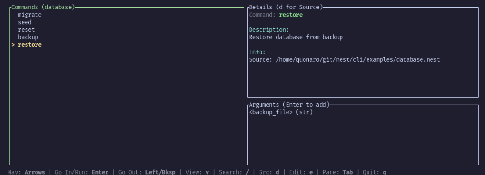
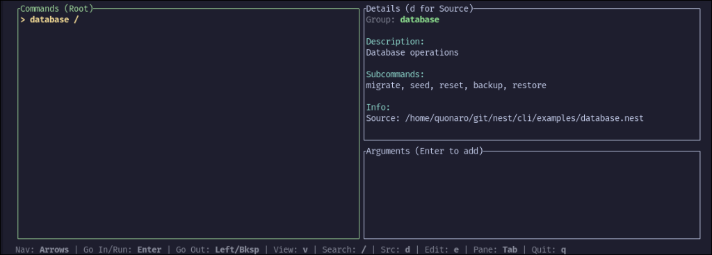

# 🪺 Nest - Task Runner for CLI Commands

> [!WARNING]
> **Important:** Highlighting the new syntax! Prefixes like `>` for directives and `@` for keywords are **deprecated**. Please use the new colon-based syntax (e.g., `script:` instead of `> script`).

**📚 Full Documentation:** [quonaro.github.io/Nest](https://quonaro.github.io/Nest)

## 🚀 Quick Start

### Installation

```bash
# Unix (Linux/macOS)
curl -fsSL https://raw.githubusercontent.com/quonaro/nest/main/install.sh | bash

# Windows (PowerShell)
irm https://raw.githubusercontent.com/quonaro/nest/main/install.ps1 | iex
```

### Extensions

Enhance your development experience with syntax highlighting and autocompletion:

- [VS Code Marketplace](https://marketplace.visualstudio.com/items?itemName=quonaro.vscode-nestfile-support)
- [Open VSX Registry](https://open-vsx.org/extension/quonaro/vscode-nestfile-support)

## 📝 Example Nestfile

```nest
# Global variables
var APP_NAME = "my-app"

# Build command with parameters
build(target: str = "x86_64"):
    desc: Build the project for the specified target
    env: NODE_ENV=production
    script: |
        echo "Building {{APP_NAME}} for {{target}}..."
        cargo build --target {{target}}

# Test command with dependency
test():
    desc: Run tests
    depends: build
    script: cargo test

# Deploy command with validation
deploy(env: str):
    validate: env in ["staging", "production"]
    script: echo "Deploying to {{env}}..."
```

## 🛠 Usage

1. Create a `Nestfile` in your project root.
2. Run commands using `nest <command>`.
3. Use `nest --list` to see all available commands.

## 🖥️ Terminal UI (TUI)

Nest includes a powerful Terminal User Interface for interactive task management:

```bash
nestui
```




With **nestui**, you can:
- Browse all commands and subcommands.
- View command descriptions and source code.
- Interactive argument entry.
- Search tasks with `/`.

For more details, advanced features, and examples, visit the [official documentation](https://quonaro.github.io/Nest).
